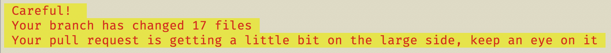

# pull-request-size-reminder

A command-line tool that queries `git`, reporting the size of your next pull request.

[](https://circleci.com/gh/mlennox/pull-request-size-reminder/tree/master)

## Why?

In a busy team you want to minimise the amount of time your colleagues spend reviewing your code. Small pull requests are usually the result of stories with a well-defined scope. Even with that, sometimes it gets away from us - especially if you are unfamiliar with the code. This package is intended to remind developers that the inevitable pull request may be large enough to annoy your colleagues.

It is intended to be used in a pre-commit and/or pre-push git hook, and is particularly useful in new projects or teams with less experienced developers.

## Example output





## Installation

```javascript
npm install --save-dev pull-request-size-reminder
```

## Usage

You can call the package from the command-line, through node.

```bash
node pull-request-size-reminder
```

The intended use is in conjunction with `husky` git hooks - `precommit` and/or `prepush`. Your project's `package.json` should be configured as below.

```javascript
{
  "scripts": {
    "precommit": "node pull-request-size-reminder"
  }
}
```

If you already have a `precommit` script then

```javascript
{
  "scripts": {
    "precommit": "someScript && node pull-request-size-reminder"
  }
}
```

### Output

The default configuration outputs a 

## Configuration

None yet!

